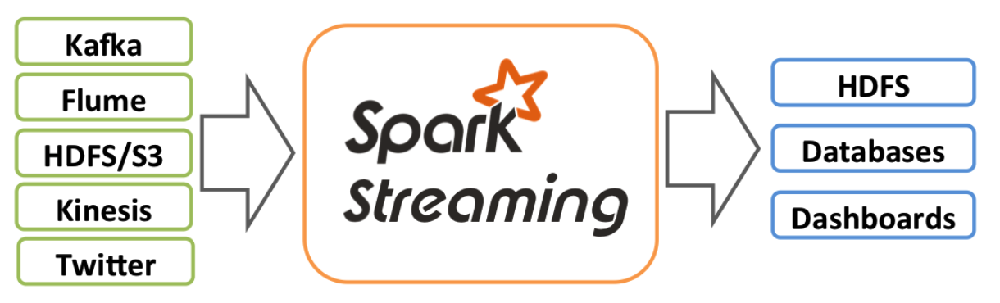
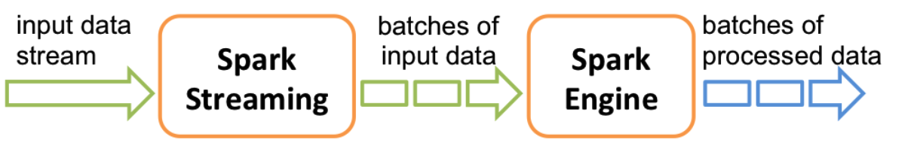

# Spark Streaming 基本概念

## 介绍

Spark Streaming是核心Spark API的扩展，可实现实时数据流的可伸缩，高吞吐量，容错流处理。可以从许多数据源（例如Kafka，Flume，Kinesis或TCP套接字）中提取数据，并可以使用以高级功能（如map，reduce，join和window）表示的复杂算法来处理数据。最后，可以将处理后的数据推送到文件系统，数据库和实时仪表板。实际上，您可以在数据流上应用Spark的机器学习和图形处理算法。

在内部，它的工作方式如下。Spark Streaming接收实时输入数据流，并将数据分成批处理，然后由Spark引擎进行处理，以生成批处理的最终结果流。

Spark Streaming提供了称为离散流（discretized stream）或DStream的高层抽象，它表示连续的数据流。可以根据来自Kafka，Flume和Kinesis等来源的输入数据流来创建DStream，也可以通过对其他DStream使用高层操作来创建DStream。在内部，DStream表示为RDD序列。

## 容错机制

### Receiver容错机制

在spark streaming中运行接收器（Receiver）的worker节点的容错能力也是一个需要考虑的重要因素。在这种情况下spark streaming会在集群的另一个节点上重启接收器。但，接收器是否会丢失接收到的数据，取决于数据源的性质和接收器的实现方式。

- 从可靠的文件系统（reliable filesystem）接收数据

例如，使用StreamingContext.hadoopFiles读取的所有数据都是可靠的，因为在该文件系统中数据已经做了备份。 Spark Streaming在检查点中记录处理了哪些数据，一旦应用程序崩溃，它可以从中断处恢复数据。

另外，接收到数据，然后给一个回执,如果发生故障，重启接收器之后，数据源会再次发生数据。

- 从不可靠的系统接收数据

例如，Kafka，基于推送的Flume或Twitter之类。spark将输入数据复制到其他节点，但是如果接收器任务失败，它会简单地丢失数据。

另外，当接收到数据，不发回执，如果driver端或者executor端失败，也将会丢失数据。

因此，总而言之，确保处理所有数据的最佳方法是使用可靠的输入源（例如，HDFS或基于拉式的Flume）。 如果您以后需要在批处理作业中处理数据，通常这也是最佳做法：它确保批处理作业和流式作业将看到相同的数据并产生相同的结果

### 任务处理的容错

由于Spark Streaming具有工作程序容错保证，因此它可以为所有转换提供一次精确的语义-即使工作程序失败并且某些数据得到重新处理，最终的转换结果（即转换后的RDD）也将与数据相同被处理一次。但是，当使用输出操作将转换后的结果推送到外部系统时，由于失败，推送结果的任务可能会多次执行，并且某些数据可能会多次推送。由于这涉及外部系统，因此取决于系统特定的代码来处理这种情况。我们可以使用事务将数据推送到外部系统（即一次原子地推送一个RDD分区），也可以将更新设计为幂等操作（这样，多次运行更新仍会产生相同的结果）。例如，Spark Streaming的saveAs ... File操作通过自动将文件完成后自动移动到其最终目的地，从而自动确保每个输出文件只有一个副本。

### 参考文献

* [Spark Streaming Programming Guide](http://spark.apache.org/docs/latest/streaming-programming-guide.html)

